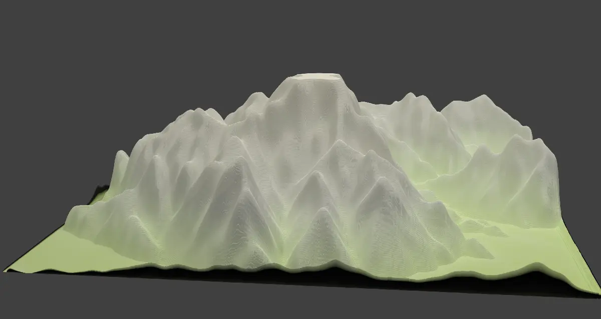
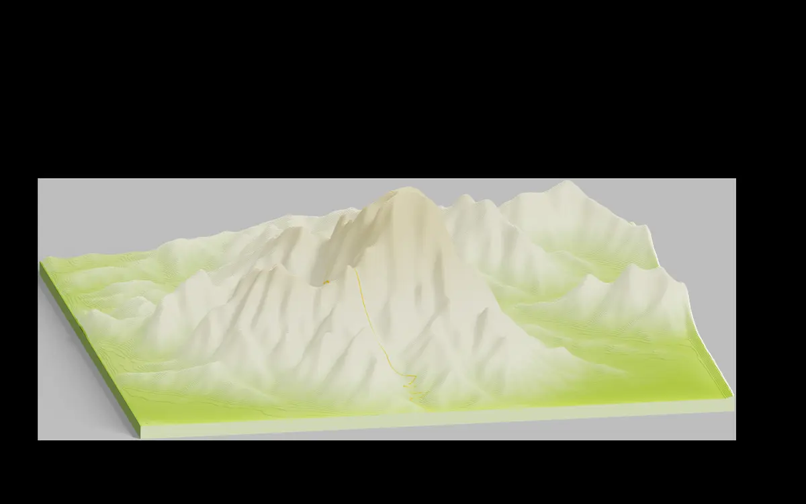
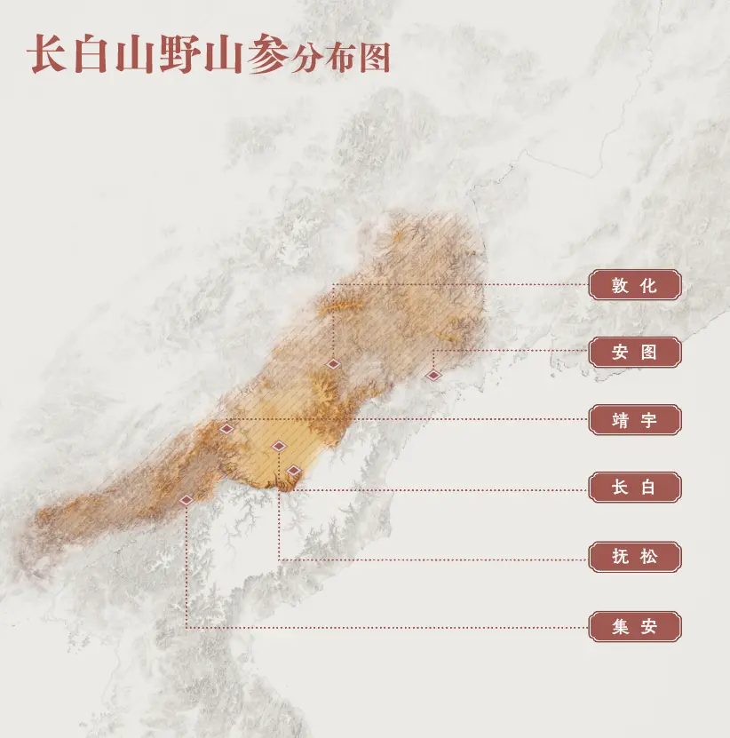
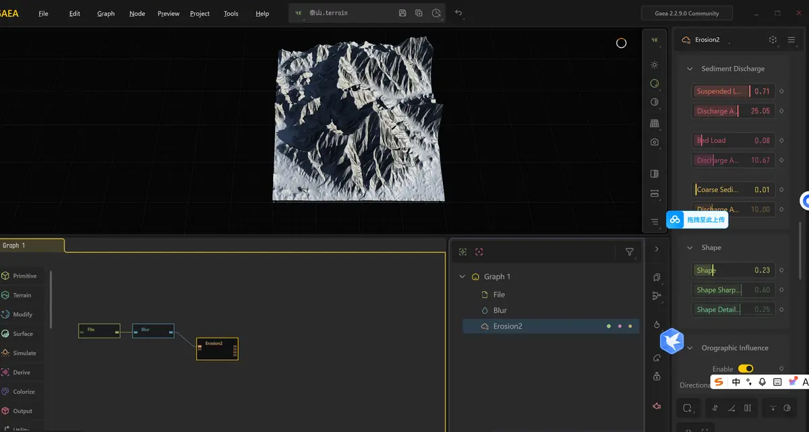
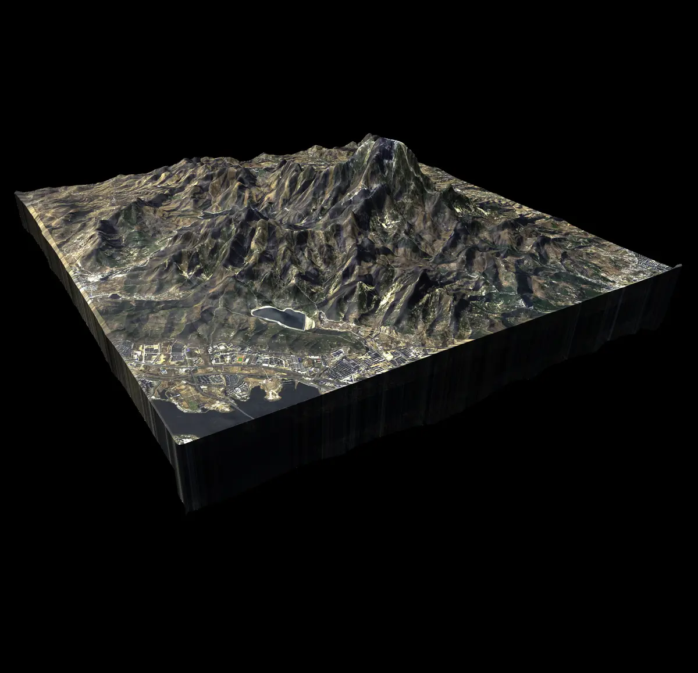
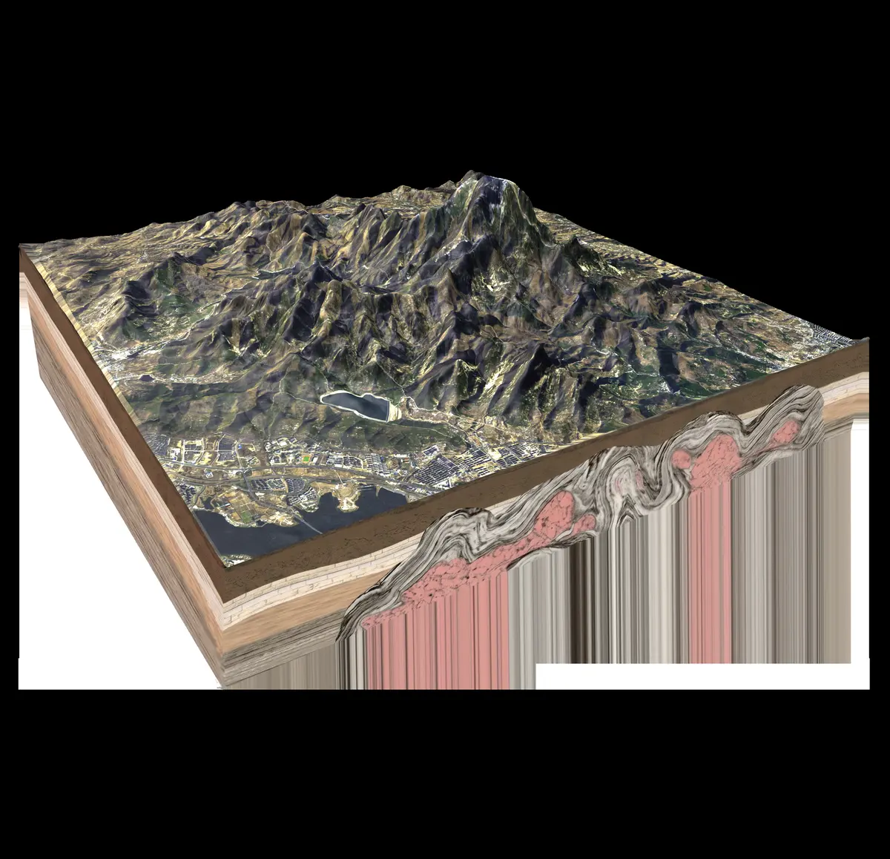

# 设计学习周报 | Weekly Log

> **学习记录中...**

---

##💡 项目快速索引 (Current Projects)
*点击链接跳转至对应项目的详细展板*

| 项目名称 | 阶段/状态 | 快速链接 |
| :--- | :--- | :--- |
| **长白山人参分布** | 材质与交互细化 | [查看展厅 →](此处填入AetherPet仓库链接) |
| **泰山地质剖面图** | 建模完成 / 复盘中 | [查看展厅 →](https://github.com/mniwangwangyu/Geo-Taishan) |
| **2025年学校课程** | 概念构思中 | [查看展厅 →](此处填入水杯仓库链接) |
| **2026年学校课程** | 概念构思中 | [查看展厅 →](此处填入水杯仓库链接) |

---

## 📅 周报更新 (Updates)

[HERE_START]

<b>📅 学习周报 01</b>

<b>📅 周报02</b>

<b>📅 周报03</b>

<b>📅 周报05</b>

<b>📅 周报04</b>

<b>📅 泰山修改 23</b>

<b>📅 周报6</b>

<b>📅 周报07</b>

<b>📅 周报08</b>

<b>📅 周报09</b>

[HERE_END]

---

## 🛠 技术储备 (Skill Tree)
- **3D Modeling:** Rhino (G2 Continuity), Blender
- **Rendering:** C4D + Octane (Commercial Grade)
- **Research:** Geological Visualization, Sustainable Materials

---
© Created by [mniwangwangyu]
