### 📅 泰山修改 23
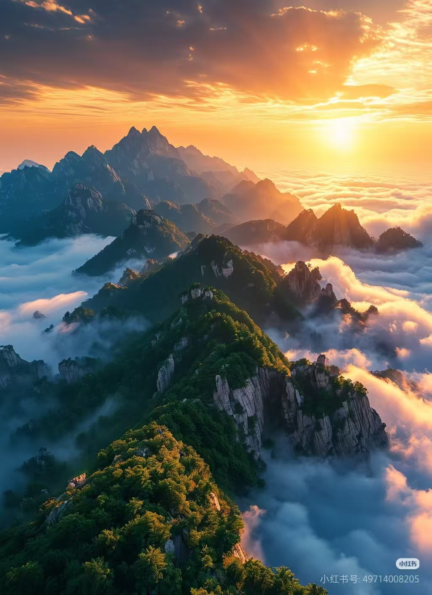

---

### 📅 周报09

---

### 📅 周报08
DEM降低了三分之一左右

和Gemini咨询了关于泰山形成和土壤及岩石垂直分层的问题

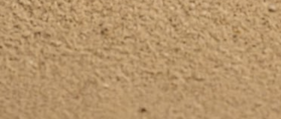

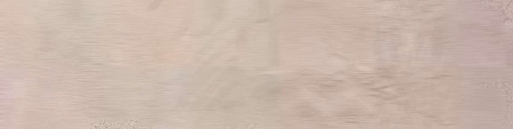

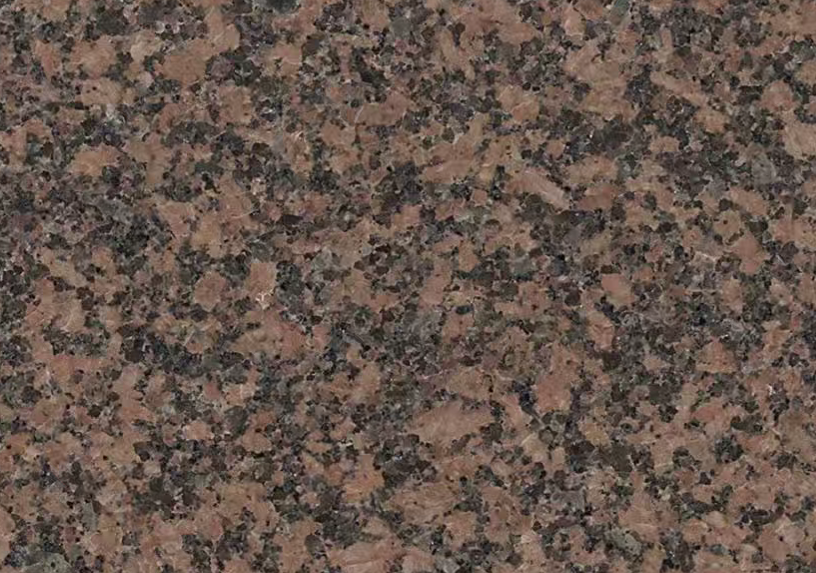

AI生成的一些岩石和土壤的肌理图再去PS里面绘制

再用AI单独把底座剖面自然融合

片麻岩和花岗岩的部分还在做目前做的图片感觉不太行很突兀

---

### 📅 周报07

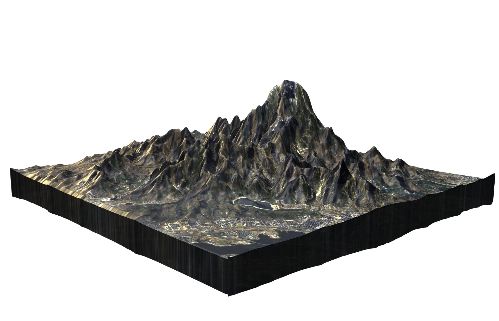

这周使用了gaea优化DEM再倒入blender的方式做了泰山模型

开始想用的是blender里面直接建模泰山的剖面，发现自己不太会blender建模后面是用的Gemini直接生成剖面然后p上去的。

Gemini生成的剖面颜色和材质不太准确后面改了改

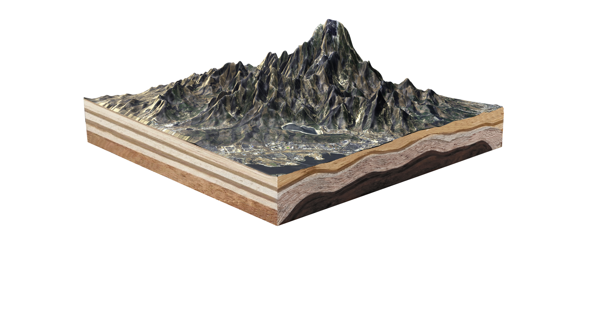

然后是基于上一周文字调研让Gemini完整的出了一版池州傩戏从视觉规范到文案的方案，方案里面排版部分不太行，但是图表部分还行。

https://gemini.google.com/share/c635d11c8180

---

### 📅 周报6
https://notebooklm.google.com/notebook/598fbcd8-60e5-4688-8f96-11e24039a1f3

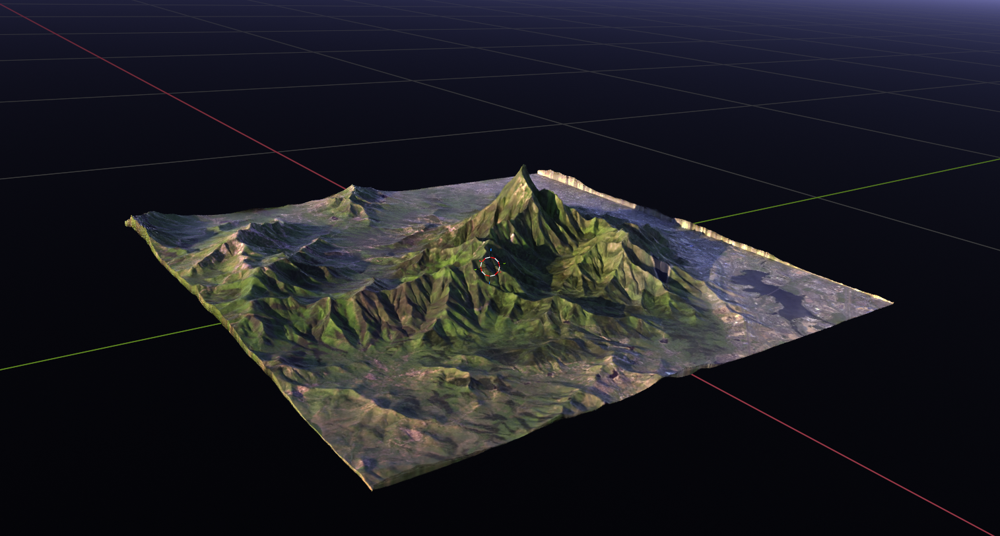

---

### 📅 周报05
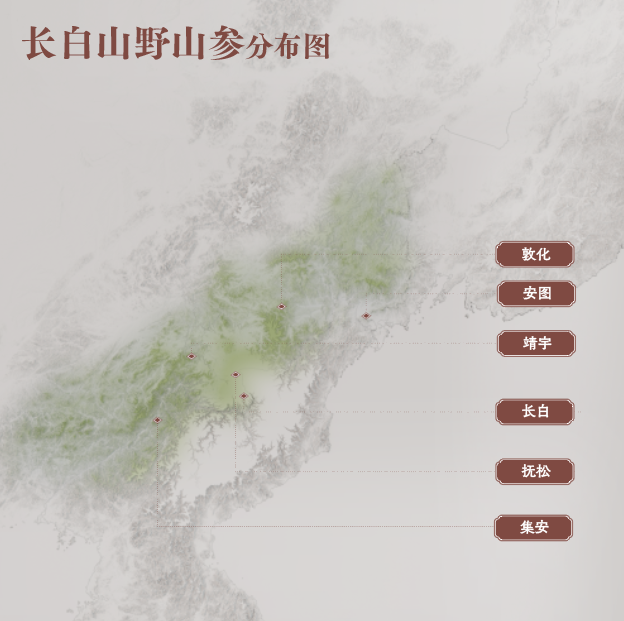

这个是换了区域颜色加强了边界

把区域的饱和度降低了一下

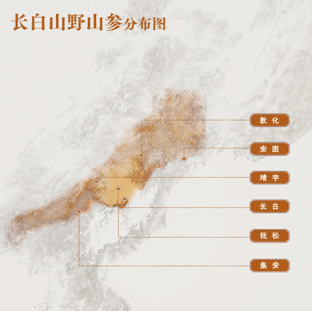

尝试了其他颜色的标注

---

### 📅 周报04

打光模仿了参考图 打成了日出的光感  测试了两个角度

把DEM放进arcgis生成等高线，使用soothline后导出shp文件  再将文件拖进qgis导出布局

打光稍微改了一下 感觉可能…立体了

---

### 📅 周报03

---

### 📅 周报02
这周尝试了使用aerialod。 如果不会打光的话感觉很方便，比我自己在blender打光做出来的好看

视角参考   感觉微微侧一下能明显看到登山路线

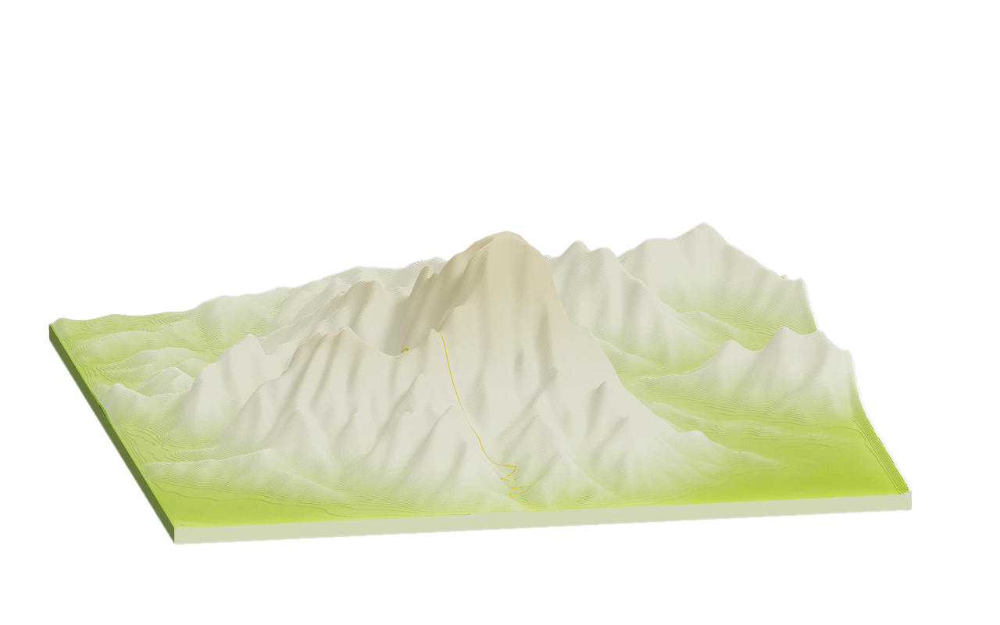

针对上周山顶扁平的解决方法

1.在aerialod里面是出图的时候在ps里面使用液化工具处理了一下

2.求助学长说是拉伸问题，然后在blender里面用实体建模不直接置换的话会解决

学长帮我在blender里面拉的DEM

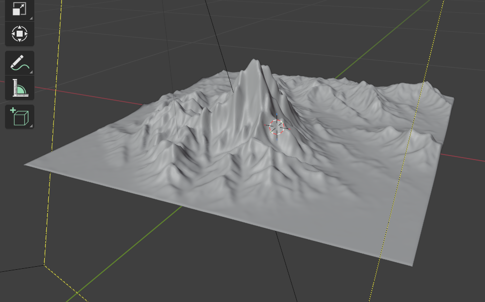

之前我是用的直接置换的方式，后面我尝试用实体建模复刻了一遍，没有出现山峰扁平的问题了。但是打光技术不太好，整体而言感觉aerialod的出图效果好一点

---

### 📅 学习周报 01
下面找的是翠绿色，上面是岩石色

开始我是吸色的学长图里面的绿色，后面导入blender里面发现颜色有点浅（色带如图）又去找的色卡

岩石色部分还没找到比较好看的颜色

                                                                                                                             终版

将图的范围缩小了

                                 之前                                                                                           现在     

对周围的山进行了修改

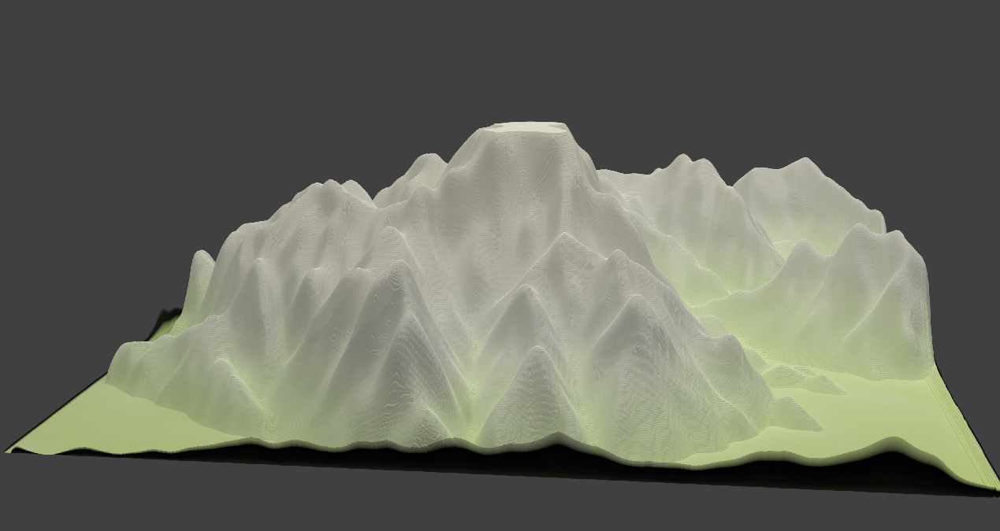

将泰山拔高周围山降低 。我用的学长发在群里的方法

但是山顶变平了，后面我加了一层高斯模糊稍微好一些

修改后的摄像机位置变低

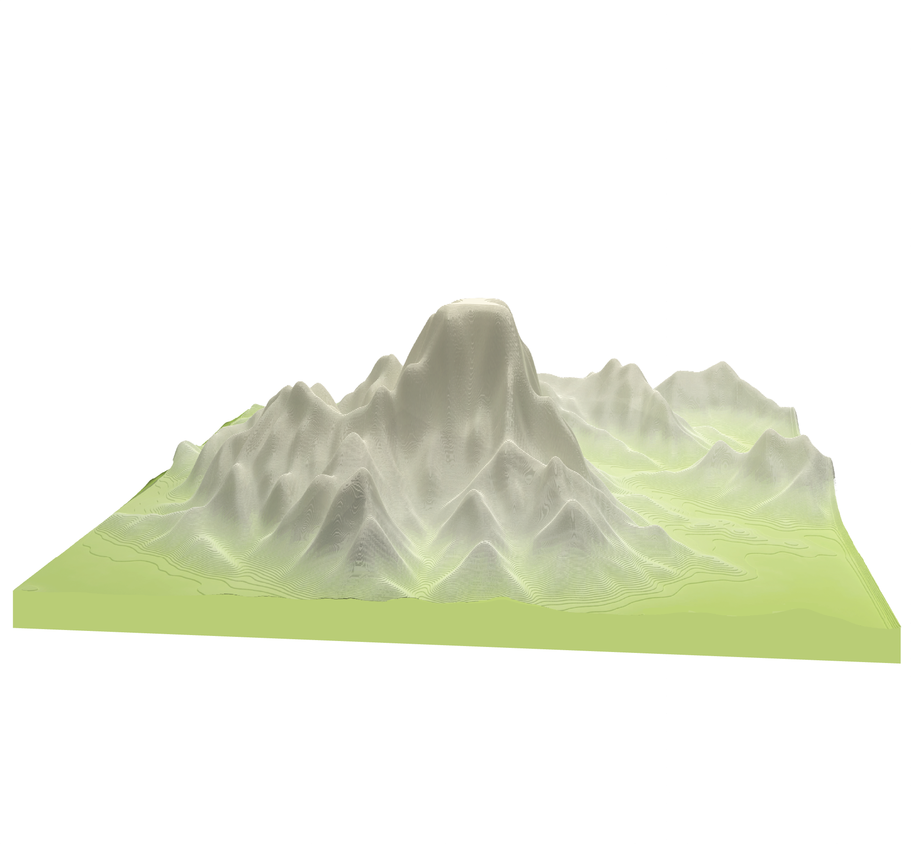

参考图

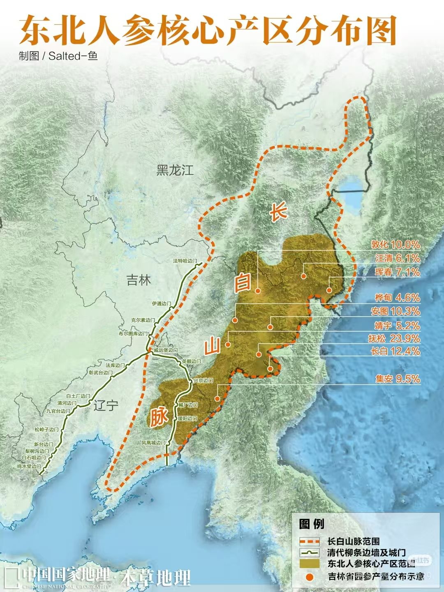

在地理空间数据云上下载的东北三省DEM有问题，求助学长，拿到了下载DEM数据的网站

http://viewfinderpanoramas.org/Coverage map viewfinderpanoramas_org3.htm

---

### 📅 泰山修改 23

---

### 📅 周报09

---

### 📅 周报08
DEM降低了三分之一左右

和Gemini咨询了关于泰山形成和土壤及岩石垂直分层的问题

AI生成的一些岩石和土壤的肌理图再去PS里面绘制

再用AI单独把底座剖面自然融合

片麻岩和花岗岩的部分还在做目前做的图片感觉不太行很突兀

---

### 📅 周报07

这周使用了gaea优化DEM再倒入blender的方式做了泰山模型

开始想用的是blender里面直接建模泰山的剖面，发现自己不太会blender建模后面是用的Gemini直接生成剖面然后p上去的。

Gemini生成的剖面颜色和材质不太准确后面改了改

然后是基于上一周文字调研让Gemini完整的出了一版池州傩戏从视觉规范到文案的方案，方案里面排版部分不太行，但是图表部分还行。

https://gemini.google.com/share/c635d11c8180

---

### 📅 周报6
https://notebooklm.google.com/notebook/598fbcd8-60e5-4688-8f96-11e24039a1f3

---

### 📅 周报05

这个是换了区域颜色加强了边界

把区域的饱和度降低了一下

尝试了其他颜色的标注

---

### 📅 周报04

打光模仿了参考图 打成了日出的光感  测试了两个角度

把DEM放进arcgis生成等高线，使用soothline后导出shp文件  再将文件拖进qgis导出布局

打光稍微改了一下 感觉可能…立体了

---

### 📅 周报03

---

### 📅 周报02
这周尝试了使用aerialod。 如果不会打光的话感觉很方便，比我自己在blender打光做出来的好看

视角参考   感觉微微侧一下能明显看到登山路线

针对上周山顶扁平的解决方法

1.在aerialod里面是出图的时候在ps里面使用液化工具处理了一下

2.求助学长说是拉伸问题，然后在blender里面用实体建模不直接置换的话会解决

学长帮我在blender里面拉的DEM

之前我是用的直接置换的方式，后面我尝试用实体建模复刻了一遍，没有出现山峰扁平的问题了。但是打光技术不太好，整体而言感觉aerialod的出图效果好一点

---

### 📅 学习周报 01
下面找的是翠绿色，上面是岩石色

开始我是吸色的学长图里面的绿色，后面导入blender里面发现颜色有点浅（色带如图）又去找的色卡

岩石色部分还没找到比较好看的颜色

                                                                                                                             终版

将图的范围缩小了

                                 之前                                                                                           现在     

对周围的山进行了修改

将泰山拔高周围山降低 。我用的学长发在群里的方法

但是山顶变平了，后面我加了一层高斯模糊稍微好一些

修改后的摄像机位置变低

参考图

在地理空间数据云上下载的东北三省DEM有问题，求助学长，拿到了下载DEM数据的网站

http://viewfinderpanoramas.org/Coverage map viewfinderpanoramas_org3.htm

---

# 设计学习周报 | Weekly Log

> **学习记录中...**

---

##💡 项目快速索引 (Current Projects)
*点击链接跳转至对应项目的详细展板*

| 项目名称 | 阶段/状态 | 快速链接 |
| :--- | :--- | :--- |
| **长白山人参分布** | 材质与交互细化 | [查看展厅 →](此处填入AetherPet仓库链接) |
| **泰山地质剖面图** | 建模完成 / 复盘中 | [查看展厅 →](https://github.com/mniwangwangyu/Geo-Taishan) |
| **2025年学校课程** | 概念构思中 | [查看展厅 →](此处填入水杯仓库链接) |
| **2026年学校课程** | 概念构思中 | [查看展厅 →](此处填入水杯仓库链接) |

---

## 📅 周报更新 (Updates)

<!-- WEEKLY-REPORT-START -->

<!-- WEEKLY-REPORT-END -->

---

## 🛠 技术储备 (Skill Tree)
- **3D Modeling:** Rhino (G2 Continuity), Blender
- **Rendering:** C4D + Octane (Commercial Grade)
- **Research:** Geological Visualization, Sustainable Materials

---
© Created by [mniwangwangyu]
